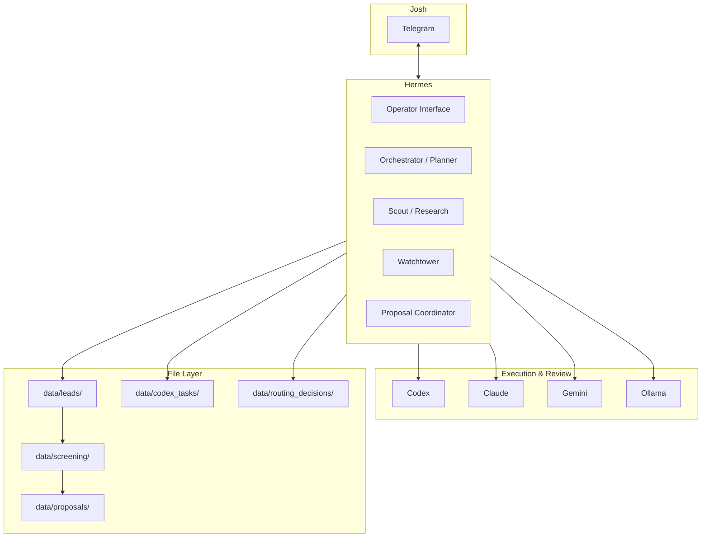

# AgentOS Project Analysis

Updated: 2026-07-06 Asia/Taipei
Last synced from: `progress_log.md`, `current_state.md` (through 2026-07-06)
Maintained by: **Cursor only** (see § Document Ownership below)
Owner: Josh Hsu
Purpose: Deep analysis of AgentOS architecture, workflows, components, and current state. This is an explanatory overview document, not a canonical spec. For authoritative status, see `docs\ARCHITECTURE.md`, `current_state.md`, and `progress_log.md`.

### Document Ownership

`E:\AgentOS\archive\Cursor_use\PROJECT_ANALYSIS.md` and `E:\AgentOS\archive\Cursor_use\RECOMMENDATIONS.md` are **Cursor-owned external analysis artifacts**. Codex, Hermes, Claude, and other agents may read and cite them but must not edit, reformat, archive, or delete them. Cleanup policy: `keep_external_cursor_owned`.

---

## 1. Core Positioning

**AgentOS** is Josh Hsu's **freelance automation operating system** at `E:\AgentOS`. It is not a generic AI agent framework. It is a **file-centric, multi-agent, Telegram-driven** business automation infrastructure whose goal is to connect lead discovery, screening, proposals, technical execution, and review into a traceable, verifiable pipeline.

| Dimension | Description |
|---|---|
| **Business goal** | Automate freelance workflow: Upwork leads → screening → proposals → technical validation/delivery |
| **Technical philosophy** | File-as-Source-of-Truth; no database/queue until the file-packet workflow is proven |
| **Human interface** | Josh ↔ Telegram ↔ **Hermes** (coordinator / brain) |
| **Independence** | Separate from `E:\AI_Projects_Hub`; borrows operational discipline only, not full governance |

**One-line summary:** Hermes is the brain, Codex is the hands, Claude is the eyes, Gemini/Ollama are auxiliary compute; Josh approves all external commitments.

---

## 2. System Architecture Overview

```text
Josh (Telegram)
      ↕
   Hermes / Hermes Lite (Brain & intake)
      |
      +-- [TYPE: ...]  → typed dispatch (zero-model routing)
      +-- URL in message → URL_INTAKE → Codex task packet → Codex worker
      +-- plain chat     → Hermes Lite via Groq free window (no tool payload)
      +-- /model, /cost  → full Hermes gateway commands
      |
      v
  File layer (Source of Truth)
      |
      +-- data/leads/ → screening/ → proposals/
      +-- data/codex_tasks/
      +-- data/routing_decisions/
      +-- docs/*.md
      |
      +-- Codex (build / verify / URL intake worker)
      +-- Claude (inspect / review)
      +-- Gemini (premium exception)
      +-- Ollama (local structured worker, not final authority)
      +-- Groq / OpenRouter (Hermes Lite chat only)
```



---

## 3. Three-Agent Protocol

Defined in `agents\roles\`. This is the core collaboration model.

| Role | Agent | Responsibility | Primary artifacts |
|---|---|---|---|
| **Brain** | Hermes | Intent, routing, task packets, Josh communication | `TASK.md`, `ROUTING_DECISION.md`, Telegram summaries |
| **Builder** | Codex | Code, scripts, tests, independent verification | `OUTPUTS\RESULT.md`, file changes |
| **Inspector** | Claude | Risk review, architecture critique, overclaim detection | Review notes, `REVIEW_RATING` |

Gemini and Ollama are **not** part of the Three-Agent Protocol ground truth. They are model resources Hermes may invoke.

### Codex operating modes

- **Builder**: Executes assigned work; results may be labeled `locally_verified`.
- **Fourth-Party Verifier**: Independently checks claims from Hermes, Claude, or prior reports; only then may use `verified_by_codex=true`.

---

## 4. Three-Layer Memory Architecture

Source: `docs\MEMORY_ARCHITECTURE.md`

Designed to control Gemini API cost by separating memory responsibilities:

```text
Layer 1: Hermes Core Memory (compact)
  - Path pointers, red-line rules, routing preferences
  - Does NOT store full logs or project history

Layer 2: AgentOS Files (Canonical / Source of Truth)
  - docs/*.md, current_state.md, progress_log.md, data/**/*

Layer 3: NotebookLM (Retrieval only, NOT truth)
  - Curated export via scripts\sync_notebooklm.py
  - Automated conveyor (DryRun @ 03:30): scripts\notebooklm_conveyor.ps1
  - Policy: docs\NOTEBOOKLM_CONVEYOR.md (Live upload manual-only)
```

**Operating rule:** Hermes remembers less and reads more. Durable memory lives in files.

---

## 5. Directory Structure

```text
E:\AgentOS\
├── agents\roles\          # Agent role definitions (hermes, codex, claude, gemini)
├── docs\                  # Architecture, routing, evidence contract, resources
├── workflows\             # Business flows (freelancer OS, Hermes→Codex packets)
├── prompts\               # Cost-saving routing prompt pack
│   ├── role_headers\
│   ├── task_templates\
│   └── context_packs\
├── config\                # Provider guards (free_model_providers.json)
├── scripts\               # Bridges, routing, maintenance, startup, handoff scripts
├── tools\                 # Subdivided operational tools (threads, network, upwork)
├── projects\              # Client portfolio projects and staging sites
├── integrations\          # Agent integrations (antigravity roles and telegram plugins)
├── data\
│   ├── ollama_eval\         # Ollama practical & speed eval runs
│   ├── usage\               # daily_token_cost_summary reports
│   ├── routing\             # routing_cache, budget_state, free_model_usage
│   ├── leads\             # Daily Upwork patrol output
│   ├── screening\         # Screening log
│   ├── proposals\         # Proposal drafts
│   ├── codex_tasks\       # Codex task packets
│   ├── routing_decisions\ # Typed dispatch decisions
│   ├── live_bridge\       # Live CLI bridge transcripts
│   ├── knowledge_pool\    # External knowledge intake
│   ├── memory\            # Hermes core memory, sync logs, HERMES_NOTES.md
│   ├── metrics\           # Queue task execution metrics (METRICS_LOG.jsonl)
│   └── escalations\       # Escalation packets and ESCALATION_INDEX.jsonl
├── logs\                  # Hermes gateway, watchdog state
├── archive\               # Legacy scripts, templates, and external Cursor analysis
│   └── Cursor_use\        # Cursor-owned reports (PROJECT_ANALYSIS.md, RECOMMENDATIONS.md)
├── current_state.md       # Snapshot index (NOT canonical spec)
└── progress_log.md        # Append-only operational history
```

**Intentionally absent:** database, message queue, long-running daemon (for now). This is a design choice.

---

## 6. Business Main Flow

Source: `workflows\ai_freelancer_os.md`

```text
08:00 Cron: daily-upwork-lead-patrol
    ↓
data/leads/YYYY-MM-DD.md
    ↓
data/screening/screening_log.md
    ↓
data/proposals/YYYY-MM-DD-<slug>.md
    ↓ Josh review
data/codex_tasks/YYYY-MM-DD-<task>/TASK.md  (if technical validation needed)
    ↓ Codex executes
OUTPUTS/RESULT.md
    ↓ Hermes summarizes to Telegram
```

### Lead patrol criteria

- Google Apps Script, Sheets automation, AppSheet, small-business workflow scripting
- Prefer budget $500+, recently posted, good client history
- Exclude vague, underpriced, or agency-fishing posts

### Observed status (2026-06-24)

Patrol blocked by Upwork Cloudflare Turnstile and search-engine CAPTCHAs. `data\leads\2026-06-24.md` recorded qualified leads = 0 with detailed rejection reasons. Files are still created to log attempts.

---

## 7. Multi-Agent Bridge Mechanisms

### 7.1 File packets (default path)

Hermes writes `TASK.md` → Codex reads and executes → writes `RESULT.md` → Hermes summarizes. No daemon; pure file handoff.

### 7.2 Live CLI bridges

| Script | Flow |
|---|---|
| `scripts\hermes_codex_bridge.ps1` | Hermes CLI → Codex CLI → Hermes |
| `scripts\hermes_claude_bridge.ps1` | Hermes → Claude review |
| `scripts\hermes_tripartite_bridge.ps1` | Hermes → Codex → Claude → Hermes |

Tripartite output layout:

```text
data/live_bridge/tripartite_<id>/
  01_HERMES_DISPATCH.md
  02_CODEX_OUTPUT.md
  03_CLAUDE_REVIEW.md
  04_HERMES_FINAL_SUMMARY.md
  TRANSCRIPT.md
```

### 7.3 Autonomous coordination mode

Default: **Josh does not relay messages** between agents.

Hermes may invoke bridges, create packets, and read results autonomously unless Josh approval is required for:

- Deletion, archive, cleanup
- `.gitignore` changes
- Install/update/credential changes
- Client messages or proposal submission
- Paid or platform-risk external operations

---

## 8. Cost-Saving Routing (Typed Dispatch v0.1)

Major recent evolution (2026-06-24), driven by Gemini API overspend.

Source: `docs\COST_SAVING_ROUTING_PROTOCOL.md`

### Input shape

```text
[TYPE: CODEX_VERIFY]
[GOAL: Verify Hermes latest report]
[TARGET: commit or path]
[CONSTRAINTS: no cleanup, no external calls]
[OUTPUT: verifier report]
```

### Routing table

| TYPE | Route to | Gemini allowed |
|---|---|---|
| `CODEX_BUILD` | Codex | No |
| `CODEX_VERIFY` | Codex | No |
| `CLAUDE_REVIEW` | Claude | No |
| `CLAUDE_WORKER` | Claude | No |
| `OLLAMA_TRIAGE` | Ollama | No |
| `URL_INTAKE` | Codex | No |
| `JOSH_APPROVAL` | Hermes (record) | No |
| `GEMINI_PREMIUM` | Gemini | Yes (explicit approval) |
| `STOP` | Hermes (stop) | No |

### Execution chain

```text
Josh [TYPE: ...] message
  → scripts\typed_dispatch.ps1 (deterministic, no model calls)
  → data/routing_decisions/<id>/ROUTING_DECISION.md
  → data/routing_decisions/<id>/ASSEMBLED_PROMPT.md
  → (Hermes/bridge dispatches to worker)
```

### Telegram integration (through 2026-06-26)

The installed plugin `agentos-typed-dispatch` at `C:\Users\brian\AppData\Local\hermes\plugins\` handles **three message classes**:

| Message type | Behavior | Model invoked |
|---|---|---|
| `[TYPE: ...]` explicit block | Typed dispatch → routing artifact; skip full Hermes agent | No |
| Message containing `http://` or `https://` | Auto `URL_INTAKE` → task packet → Codex worker | Codex only (at worker step) |
| Plain text (no slash command) | **Hermes Lite** via guarded Groq (`free_model_window.ps1`) | Groq (lite, no tools) |
| Slash commands (`/model status`, etc.) | Pass through to full Hermes gateway | Depends on command |

**Hermes Lite** identity: low-cost Telegram intake voice. It must not claim routing, file actions, or link summarization unless a typed-dispatch artifact or task packet exists.

**Groq limitation:** Full Hermes agent on Groq fails with `413` (~21k tokens vs 6k TPM limit) because Hermes sends system prompt + 30 tool schemas. Hermes Lite avoids this by using a no-tools wrapper.

**Hermes manual model aliases** (AppData runtime):

- `/model groq` → provider `agentos-groq` (`llama-3.1-8b-instant`)
- `/model openrouter-free` → provider `agentos-openrouter-free` (`openrouter/free`)
- `/model ollama`, `/model local` → local Ollama via `localhost:11434`

**Remaining gaps:**

- General `[TYPE: CODEX_VERIFY]` etc. still stop at `ready_to_route` (no auto bridge)
- External URL fetch in URL intake requires Josh approval (`source_not_verified=true`)
- Hermes Lite UTF-8 fix applied; gateway restart may be needed for hook decoder

Handoff doc: `docs\TELEGRAM_TYPED_DISPATCH_HANDOFF.md`

---

## 9. URL Intake Execution Loop (2026-06-25)

First **closed dispatch → worker loop** in AgentOS:

```text
Josh pastes URL in Telegram
  → Hermes plugin detects http(s)://
  → typed_dispatch.ps1 (type=URL_INTAKE, models_invoked=false)
  → data/routing_decisions/<id>/ROUTING_DECISION.md
  → scripts/url_intake_task_packet.ps1 → data/codex_tasks/.../TASK.md
  → scripts/url_intake_worker.ps1 → Codex CLI (read-only sandbox)
  → OUTPUTS/RESULT.md + WORKER_STATUS.md
  → Telegram summary with codex_execution_status
```

Scripts:

| Script | Role |
|---|---|
| `url_intake_task_packet.ps1` | Converts routing decision to Codex TASK.md; does not fetch URL |
| `url_intake_worker.ps1` | Invokes Codex CLI; clears stale API keys from child env |

Success gate: `codex_execution_status=completed`. External URL read still blocked without Josh approval.

Verified live task example:

```text
data\codex_tasks\2026-06-25-url-intake-telegram-telegram-1449022024-1007-20260625-192901\OUTPUTS\RESULT.md
```

---

## 10. Free Cloud Window Policy (2026-06-25)

Source: `docs\FREE_CLOUD_WINDOW_POLICY.md`

Conservative guard for cheap/free routine chat so Gemini is not the default operator layer.

| Provider | Status | Guard |
|---|---|---|
| Groq | `candidate_free_plan_limited` | Free-plan models only; daily cap 30 requests |
| OpenRouter | `candidate_free_models_only` | `openrouter/free` or `:free` slugs only |
| Kimi API | Deferred | API free status not verified |
| Cloudflare Workers AI | Deferred | Not guaranteed zero-cost |
| Ollama | Local fallback only | Available but not preferred as normal chat (slow) |

Guard artifacts:

```text
config\free_model_providers.json
scripts\free_model_window.ps1
data\routing\free_model_usage_YYYY-MM-DD.json
```

Policy rules:

- `allow_paid_models=false`
- `allow_paid_tools=false`
- `fallback_to_gemini=false`
- Default daily cap: 30 attempted requests per provider

Verification (2026-06-25/26):

- Dry-run and guarded live tests completed for Groq and OpenRouter
- Hermes user providers `agentos-groq` and `agentos-openrouter-free` added with `key_env`
- Plain Telegram chat routed through **Hermes Lite** (Groq, no tools) — not full Hermes/Gemini
- **`hermes_default_chat_switched_to_free_window=false`** — full Hermes agent default unchanged; lite hook handles ordinary chat

---

## 11. Daily Token Cost Cron Throttle (2026-06-25)

The `Daily-Token-Cost-Summary` cron previously hit Gemini at midnight and failed with `RESOURCE_EXHAUSTED`.

**Fix:**

- Script: `scripts\daily_token_cost_summary_noagent.py`
- Hermes copy: `C:\Users\brian\AppData\Local\hermes\scripts\daily_token_cost_summary_noagent.py`
- Cron mode: `no-agent` — reads `state.db` aggregate counters only
- Output: `data\usage\daily_token_cost_summary\YYYY-MM-DD.md` when counters change; silent otherwise
- Verified: `models_invoked=false`, `external_services_invoked=false`

---

## 12. Ollama Practical Model Evaluation (2026-06-26)

Source: `docs\OLLAMA_MODEL_PRACTICAL_EVALUATION.md`, `docs\OLLAMA_SPEED_EVALUATION.md`

Four installed models evaluated with reusable runners:

| Model | Practical role | Speed (warm avg) |
|---|---|---|
| `qwen2.5-coder:7b` | **Best structured local worker** | ~2.41s |
| `qwen3:8b` | Evidence-audit / URL-intake drafts (`think=false`) | ~3.11s |
| `llama3.2:3b` | Trivial formatting / smoke only | ~1.52s (fastest) |
| `qwen3.5:9b` | Too slow for routine queues | ~10.07s |

Key finding: Qwen thinking models require `think=false` or output may be empty (tokens spent in `thinking` field).

**Ollama must not be final authority** for approval, safety, customer-facing, deletion, production-ready, or external URL decisions.

Evidence: `data\ollama_eval\2026-06-26-practical\`, `data\ollama_eval\2026-06-26-speed-nothink\`

---

## 13. NotebookLM Conveyor (2026-06-26)

Source: `docs\NOTEBOOKLM_CONVEYOR.md`

Automated Layer 3 sync pipeline:

```text
scripts/export_notebooklm_sources.ps1  → export package
scripts/notebooklm_conveyor.ps1        → DryRun or Live sync
scripts/register_notebooklm_conveyor_task.ps1 → Windows Scheduled Task
```

| Setting | Value |
|---|---|
| Schedule | Daily 03:30 |
| Scheduled mode | **DryRun only** (policy blocks automated Live upload) |
| Manual Live | `powershell -ExecutionPolicy Bypass -File scripts\notebooklm_conveyor.ps1 -Mode Live` |
| DryRun verified | 43 export sources, 44 Markdown files discovered |
| Default notebook | `79ef4683-f7d2-43da-b8d3-7298858949e5` |

`sync_notebooklm.py` updated: fixed Markdown discovery bug, added `--title-mode relpath-hash`.

---

## 14. Evidence and Reporting Contract

Source: `docs\EVIDENCE_AND_REPORTING_CONTRACT.md`

Unified status labels prevent agent overclaiming:

| Label | Meaning |
|---|---|
| `claimed_by_agent` | Agent claims completion; no independent verification |
| `artifact_created` | File exists; content not verified |
| `locally_verified` | Executor ran local checks on own work |
| `verified_by_codex` | Codex **independently** confirmed claim with evidence |
| `reviewed_by_claude` | Claude reviewed (≠ execution success) |
| `approved_by_josh` | Josh explicitly approved |
| `production_ready` | Implementation, environment, error handling, and verification all complete |

**Red lines:**

- File existence ≠ correct content
- Commit hash ≠ claim validity
- Dry-run success ≠ live success
- Claude `PASS` ≠ `production_ready`

---

## 15. Resources and Model Strategy

Sources: `docs\RESOURCE_INVENTORY.md`, `docs\AGENT_ROUTING_PLAN.md`

| Resource | Cost class | Primary use |
|---|---|---|
| Codex CLI | Subscription | Build, verify, repo work |
| Claude CLI | Subscription | Review, risk, architecture critique |
| Gemini API | Metered | **Frozen** for routine; premium only |
| Ollama | Local zero-cost | Structured worker (`qwen2.5-coder:7b`); not final authority |
| Groq API | Candidate free-plan | **Hermes Lite** plain Telegram chat (no tools) |
| OpenRouter API | Candidate free-models | Manual `/model openrouter-free`; backup chat |
| Perplexity | Subscription (manual) | Fresh external sources |
| Cursor / IDEs | Manual | Josh desktop coding |

### Hermes internal mode → model mapping

| Mode | Preferred resource |
|---|---|
| Operator Interface / plain Telegram | **Hermes Lite** (Groq via free window) |
| Orchestrator / Planner | Gemini Flash premium; Ollama `qwen2.5-coder:7b` for drafts |
| Scout / Research | Gemini premium or Perplexity manual |
| Watchtower | Ollama `llama3.2:3b` or `qwen2.5-coder:7b` |
| Proposal Coordinator | Gemini premium + Claude review |
| URL intake worker | Codex CLI (subscription) |

**Degraded mode:** When Gemini is rate-limited, switch to Ollama; defer proposal-quality writing and high-impact planning.

---

## 16. Infrastructure Scripts

| Script | Function |
|---|---|
| `start.ps1` | Start Hermes gateway + proxy |
| `watchdog.ps1` | Process health monitoring |
| `model_fallback.ps1` | Model degradation |
| `typed_dispatch.ps1` | Deterministic typed routing (incl. URL_INTAKE) |
| `telegram_typed_dispatch_entry.ps1` | Telegram hook entrypoint |
| `free_model_window.ps1` | Guarded Groq/OpenRouter; Hermes Lite backend |
| `url_intake_task_packet.ps1` | URL_INTAKE → Codex TASK.md |
| `url_intake_worker.ps1` | URL intake → Codex CLI execution |
| `daily_token_cost_summary_noagent.py` | No-agent cron token summary |
| `ollama_practical_eval.ps1` | Ollama capability evaluation |
| `ollama_speed_eval.ps1` | Ollama speed benchmarking |
| `export_notebooklm_sources.ps1` | NotebookLM export package |
| `notebooklm_conveyor.ps1` | NotebookLM sync conveyor (DryRun/Live) |
| `register_notebooklm_conveyor_task.ps1` | Register 03:30 DryRun scheduled task |
| `hermes_*_bridge.ps1` | Live CLI agent bridges |
| `sync_notebooklm.py` | Layer 3 NotebookLM sync |
| `memory_guard.ps1` | Memory protection (dry-run default) |
| `fan_control\run.bat` | Fan control CLI (device maintenance) |
| `hermes_usage_audit.py` | Hermes usage audit |

**Device maintenance** is separated from client delivery under `data\projects\device_maintenance.md`.

---

## 17. Current State Snapshot

Based on `current_state.md` and `progress_log.md` (through 2026-07-06).

### Verified working

- Hermes Telegram + plugin `agentos-typed-dispatch` with three message classes
- Typed dispatch live verified (`models_invoked=false` for explicit `[TYPE: ...]`)
- **Hermes Lite** plain chat via Groq free window (no full-agent tool payload)
- **URL intake full loop**: routing → TASK.md → Codex worker → RESULT.md
- Hermes free-window providers: `agentos-groq`, `agentos-openrouter-free`
- `/model status` hotfix in live gateway runtime
- Daily-Token-Cost-Summary cron throttled to no-agent
- Ollama practical + speed evaluation completed (4 models)
- NotebookLM conveyor DryRun verified (43 sources, 44 Markdown); scheduled 03:30
- Tripartite bridge CLI handoff; Three-Agent Protocol role hygiene
- **Workflow v1.2** is fully operational (deterministic powershell queue running, Blind Verify session isolation, automated metrics / escalation JSON writing).
- **Handoff automation**: `scripts\send_task_to_antigravity.ps1` and `integrations\antigravity\AGENTOS_ROLE.md` fully verified.
- **Root-level file cleanup**: All miscellaneous files reorganized under `tools\`, `data\`, and `archive\`, with real-time governance status fully `aligned` (drift_count=0).
- **Hermes Notes Governance boundary**: added correction to `HERMES_NOTES.md` clarifying its subordinate status to `AGENTS.md`.

### In progress / partial

- Fan Control: `partial_sensor_unavailable` on host
- Evidence cleanup: Phase 2E root cleanup completed; cleanup_executed=true (aligned)
- Hermes Lite UTF-8: fix applied; gateway restart may be pending for hook decoder
- External URL fetch in URL intake: `josh_approval_required=true`
- General typed dispatch types (CODEX_VERIFY, CLAUDE_REVIEW): still `ready_to_route` only
- NotebookLM Live upload: manual command only (scheduled Live blocked by policy)

### Known blockers

| Issue | Impact |
|---|---|
| Upwork Cloudflare Turnstile | Automated lead patrol blocked |
| Groq full Hermes agent | 413 / TPM limit (~6k vs ~21k tokens); use Hermes Lite instead |
| Hermes proxy localhost:8080 | Claude proxy upstream unavailable |
| No real lead→proposal→codex cycle | Business flow not end-to-end in production |
| Python 3.13 launcher broken | WindowsApps launcher execution error; manual env fallback required |
| Claude/Codex quotas | Restricted usage limits reported by Josh |

### Security findings (Claude independent review)

- `scrape_upwork.py`: high ToS violation risk (quarantined and subsequently deleted)
- `env_manager.py`: medium plaintext secrets risk
- `monitor_ui.py`: low risk

---

## 18. Design Philosophy

1. **Files over frameworks** — Markdown + directories instead of queue/DB for auditability
2. **Graded evidence** — Every claim has an explicit verification level
3. **Cost-aware routing** — Gemini is premium exception, not default brain
4. **Clear human boundaries** — Josh approves external commitments; agents coordinate internal technical work
5. **Progressive automation** — Prove file-packet workflow before daemons
6. **Independent from Hub** — Small system; borrows discipline, not full governance machinery

---

## 19. Relationship to AI_Projects_Hub

586: AgentOS remains independent from `E:\AI_Projects_Hub` governance.

**Reused from Hub:**

- Explicit status reporting
- Append-only operational logs
- Concrete handoff artifacts

**Not reused:**

- Singleton governance docs
- Hub ownership transfer protocols
- Broad workspace control-plane machinery

Hermes runtime for live Telegram operations is under:

```text
C:\Users\brian\AppData\Local\hermes
```

An older checkout also exists at `E:\AI_Projects_Hub\External_AI_Agents\hermes-agent`; treat AppData as the active runtime for gateway, plugins, and model aliases.

---

## 20. Explicit Non-Goals (Current)

- No second lead-finding agent (Hermes owns patrol)
- No database/queue/broker until file-packet workflow is proven
- No full Hub governance copy into AgentOS
- Codex must not contact clients or make pricing commitments
- No claiming proxy/Claude/gateway behavior is solved until end-to-end tested

---

## 21. Recommended Reading Order

1. `README.md` — Overview
2. `docs\ARCHITECTURE.md` — Architecture and gaps
3. `agents\roles\hermes.md` — Hermes six internal modes
4. `docs\COST_SAVING_ROUTING_PROTOCOL.md` — Typed dispatch routing
5. `docs\FREE_CLOUD_WINDOW_POLICY.md` — Free provider guard policy
6. `docs\NOTEBOOKLM_CONVEYOR.md` — NotebookLM automated sync
7. `docs\OLLAMA_MODEL_PRACTICAL_EVALUATION.md` — Local model routing
8. `docs\EVIDENCE_AND_REPORTING_CONTRACT.md` — Status language
9. `workflows\ai_freelancer_os.md` — Business pipeline
10. `current_state.md` — Latest snapshot index
11. `progress_log.md` — Full change history
12. `archive\Cursor_use\RECOMMENDATIONS.md` — Prioritized next steps
13. `archive\Cursor_use\PROJECT_ANALYSIS.md` — This document

---

## 22. Assessment

AgentOS is **not another generic AI agent framework**. It is Josh's **personal freelance company operating system**: files, contracts, graded evidence, and multi-agent bridges turn Telegram instructions into a traceable, verifiable, cost-controlled automation pipeline.

**Infrastructure maturity now clearly exceeds business-flow maturity**, and significant progress occurred in late June and early July:

- Cost path: Hermes Lite + typed dispatch + no-agent cron largely removed routine Gemini spend
- Execution path: URL intake proved the first **dispatch → worker → RESULT** closed loop
- Handoff path: Automated Antigravity task pasting script implemented and verified
- Reorganization: Root directory tidied up and aligned under v1.2 governance基線

Main remaining gaps: **Upwork access**, **general typed-dispatch worker wiring** (beyond URL_INTAKE), and **first real lead→proposal cycle**.

---

## 23. Change Log (Synced Updates)

This section mirrors major entries from `progress_log.md`. For full detail, read the source log.

| Date | Change | Status |
|---|---|---|
| 2026-06-24 | Cost-Saving Routing Protocol v0.1 + prompt pack | `locally_verified` |
| 2026-06-24–25 | Telegram typed-dispatch plugin: install → async fix → live verify | `verified_by_codex` |
| 2026-06-25 | Free Cloud Window guard + Hermes providers `agentos-groq`, `agentos-openrouter-free` | `locally_verified` |
| 2026-06-25 | Daily-Token-Cost-Summary throttled to no-agent | `locally_verified` |
| 2026-06-25 | `/model status` hotfix in live gateway runtime | `locally_verified` |
| 2026-06-25 | Plain chat → **Hermes Lite** (Groq, no tools); Groq full-agent blocked by TPM | `locally_verified` |
| 2026-06-25 | Hermes Lite overclaim fix; URL auto-intake (`URL_INTAKE`) | `locally_verified` |
| 2026-06-25 | URL intake: task packet + Codex worker execution loop | `verified_with_codex_cli` |
| 2026-06-25 | Cursor ownership recorded for PROJECT_ANALYSIS + RECOMMENDATIONS | `artifact_created` |
| 2026-06-26 | Ollama practical + speed evaluation (4 models) | `locally_verified` |
| 2026-06-26 | NotebookLM conveyor (DryRun schedule 03:30; Live manual-only) | `locally_verified` |
| 2026-06-26 | Cursor sync update to PROJECT_ANALYSIS + RECOMMENDATIONS | `artifact_created` |
| 2026-07-05 | Phase 1-03 Root Cleanup completed. Reorganized legacy scripts, network logs, and HERMES_NOTES.md. Updated docs\INDEX.md and corrected HERMES_NOTES.md governance authority. | `locally_verified` |
| 2026-07-06 | Created send_task_to_antigravity.ps1 automated handoff script and AGENTOS_ROLE.md integration contract. Passed CopyOnly and Fail-Closed security verification. | `verified_by_codex` |

---

## Related Documents

- Architecture: `docs\ARCHITECTURE.md`
- Memory: `docs\MEMORY_ARCHITECTURE.md`
- Routing: `docs\AGENT_ROUTING_PLAN.md`
- Cost protocol: `docs\COST_SAVING_ROUTING_PROTOCOL.md`
- Free cloud window: `docs\FREE_CLOUD_WINDOW_POLICY.md`
- Telegram handoff: `docs\TELEGRAM_TYPED_DISPATCH_HANDOFF.md`
- Ollama eval: `docs\OLLAMA_MODEL_PRACTICAL_EVALUATION.md`, `docs\OLLAMA_SPEED_EVALUATION.md`
- NotebookLM conveyor: `docs\NOTEBOOKLM_CONVEYOR.md`
- Evidence: `docs\EVIDENCE_AND_REPORTING_CONTRACT.md`
- Resources: `docs\RESOURCE_INVENTORY.md`
- Recommendations: `archive\Cursor_use\RECOMMENDATIONS.md`
- Snapshot: `current_state.md`
- History: `progress_log.md`
